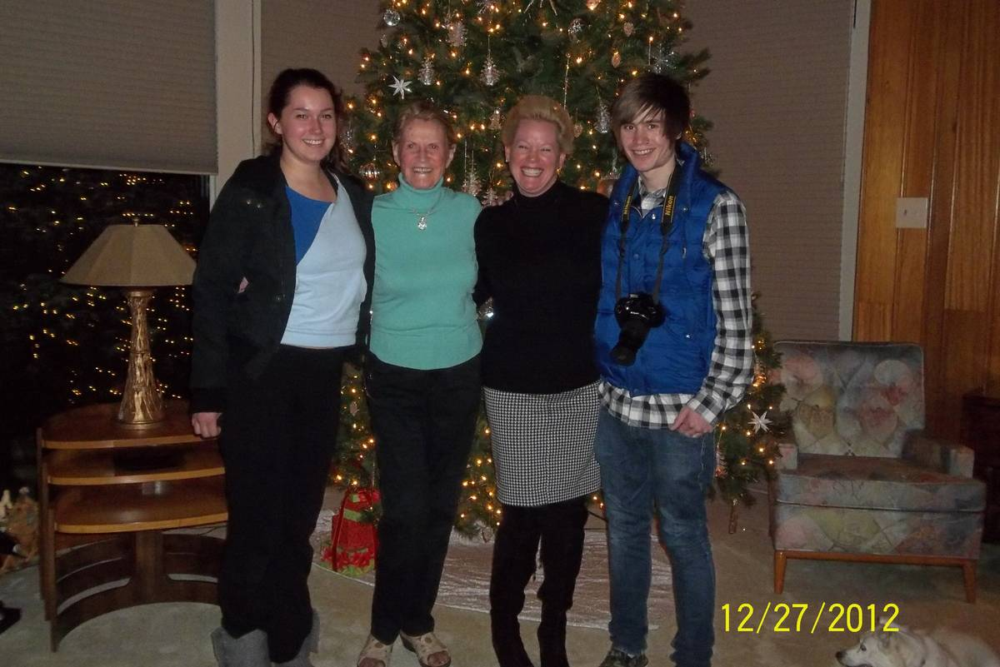
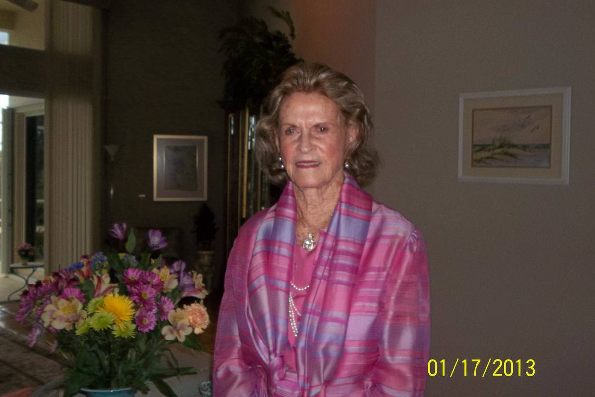
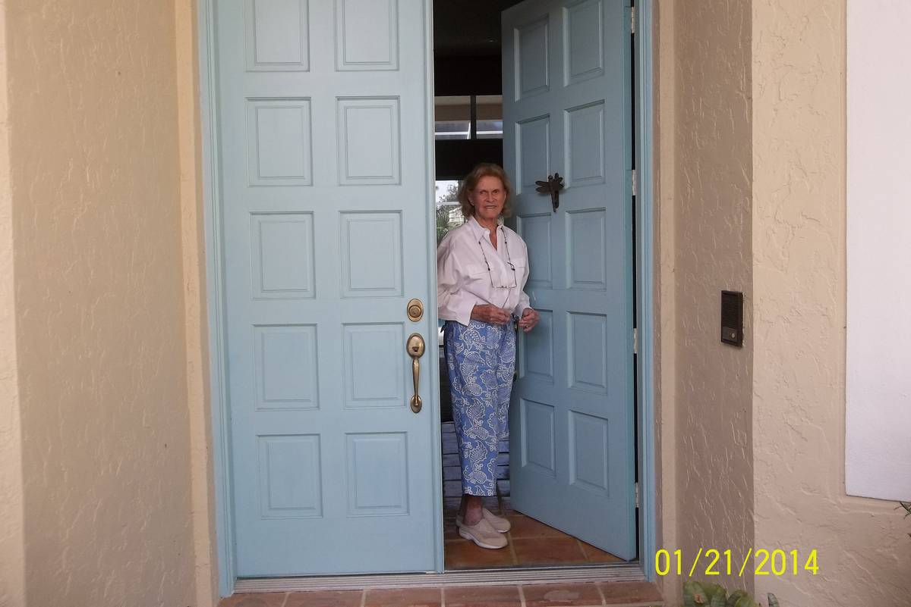

+++
id = "dat:1412-fran-library-five-dated-anchors"
layer = 1
type = "datum"
title = "Five readable dates in the Fran library (Dec 2012 - Jan 2014)"
claim = "Five of 30 Fran-library images carry readable embedded or handwritten dates: 12/27/2012 (Christmas group photo, four people in red/blue, 'Merry Christmas' on cabinet), 01/17/2013 (upscale interior portrait of an older blonde woman), 01/22/2013 (kitchen photo of an older blonde woman), 05/02/2013 (two photos: young woman with drink; back-porch scene with older blonde woman), 01/21/2014 (older blonde woman in a doorway)."
cites = ["src:gphotos-fran-library"]
confidence = "high"
tags = ["fran-coldren", "photographs", "dating"]
importance = 3
created = "2026-09-11"

[when]
start = "2012-12-27"
end = "2014-01-21"
+++

**Evidence class:** audiovisual (screenshot timestamps/photographed prints; provenance of the printed dates is unestablished).

The five anchors are the only hard dates in the album; everything else floats inside the share-page range Jun 17, 2007 - May 4, 2018. The older blonde woman recurring across the dated photos is the album's titled subject, Fran Coldren - identification of *other* figures is provisional and not asserted here.

