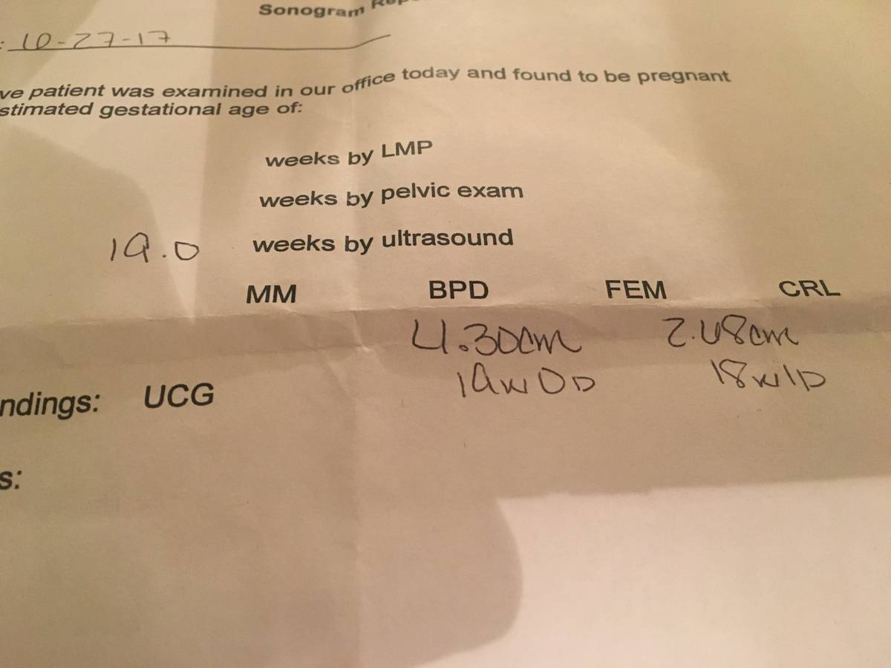
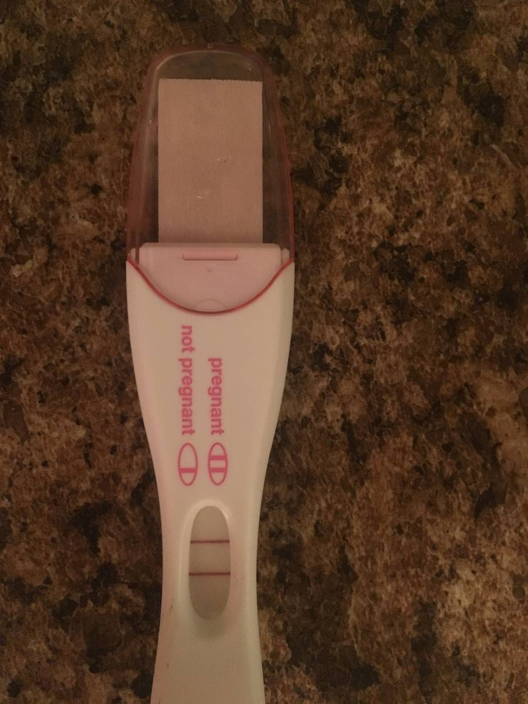

+++
id = "dat:1414-dannie-sonogram-2017-10-27"
layer = 1
type = "datum"
title = "Sonogram report photographed in DANNIE HISTORY (handwritten date 10-27-17, 19.0 weeks)"
claim = "A sonogram report photographed on a granite countertop carries handwritten date '10-27-17' and 'Est. gestational age 19.0' (weeks); the table lists BPD 4.30 cm (10w0d), CRL 2.48 cm (18w1d), and findings 'UCG'; the patient name is not legible in the frame. A positive pregnancy test (two lines) photographed on the same countertop appears to be the same household."
cites = ["src:gphotos-dannie-history"]
confidence = "high"
tags = ["annie-ulmer", "pregnancy", "2017"]
importance = 4
created = "2026-09-11"

[when]
start = "2017-10-27"
+++

**Evidence class:** audiovisual (document photographed in full resolution; transcription verified).

Internal note: the table's per-measurement age reads (10w0d, 18w1d) sit oddly against the handwritten 19.0-week estimate; this is recorded as an observed tension in the document itself, not resolved here. Patient identity is *not* established by this frame. Relationship attribution rests on album context (DANNIE HISTORY) plus the corpus messages in dat:1415, and is graded accordingly - it is not laundered into this datum.

