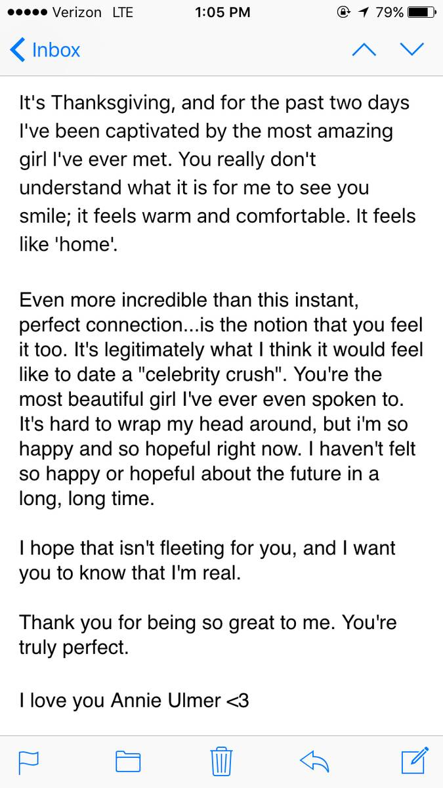

+++
id = "dat:1416-dannie-thanksgiving-love-letter"
layer = 1
type = "datum"
title = "Thanksgiving love letter to 'Annie Ulmer' (DANNIE HISTORY)"
claim = "A screenshot of Dan's email inbox shows a Thanksgiving love letter signed 'I love you Annie Ulmer <3': 'for the past two days I've been captivated by the most amazing girl I've ever met... it feels like home... the most beautiful girl I've ever even spoken to.' No year is shown; the album range opens Nov 27, 2015 (Thanksgiving 2015 was Nov 26)."
cites = ["src:gphotos-dannie-history"]
confidence = "high"
tags = ["annie-ulmer", "2015", "relationship"]
importance = 3
created = "2026-09-11"

[[edges]]
rel = "about"
target = "ent:annie-ulmer"
strength = "strong"
asserted_by = "self"
+++

**Evidence class:** audiovisual (Dan's own writing, primary).

If the Thanksgiving is 2015, 'the past two days' independently corroborates the ~Nov 24, 2015 introduction estimate in evt:2015-11-annie-relationship-starts. The year is *not* asserted - the inference is flagged, not laundered. The screenshot is inbox-level; the full message body beyond the preview is not in the record.

