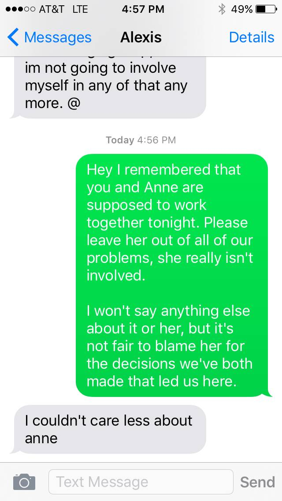
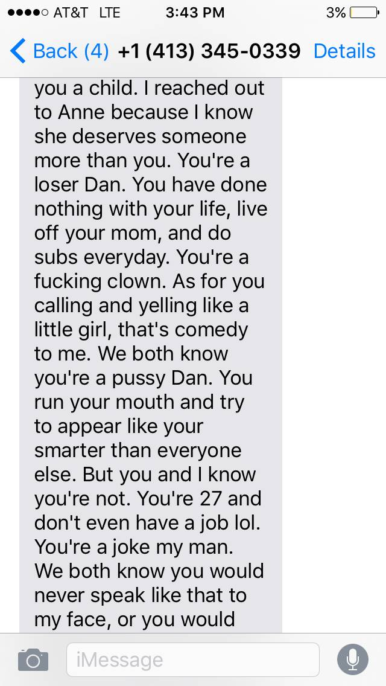

+++
id = "dat:1417-dannie-hostile-perimeter-2015"
layer = 1
type = "datum"
title = "Hostile perimeter around the new relationship (Alexis iMessage + (413) screed)"
claim = "Two DANNIE HISTORY screenshots show (a) an iMessage thread labeled 'Alexis' in which Alexis refuses involvement ('I couldn't care less about anne'; Dan asks her to leave Anne out of their problems), and (b) a long abusive message from a +1 (413) number ('You're a loser Dan... You're 27 and don't even have a job lol... do subs everyday'; 'I'm so glad ur out of her life'). The (413) sender is unidentified; the number is masked here and no corpus match was found for it."
cites = ["src:gphotos-dannie-history"]
confidence = "high"
tags = ["annie-ulmer", "alexis-armel", "2015"]
importance = 3
created = "2026-09-11"

[[edges]]
rel = "about"
target = "ent:annie-ulmer"
strength = "moderate"
asserted_by = "llm"
+++

**Evidence class:** audiovisual (screenshots, primary for their own content).

Sender-identity of (b) is unknown - not asserted. The full number exists only in the source screenshot's own metadata; it is reproduced nowhere in this node and is not independently verified. Both screenshots sit early in the album's range and document third-party hostility around the relationship's start, consistent with the Alexis-eviction timeline (Nov 2015) without proving causation.

