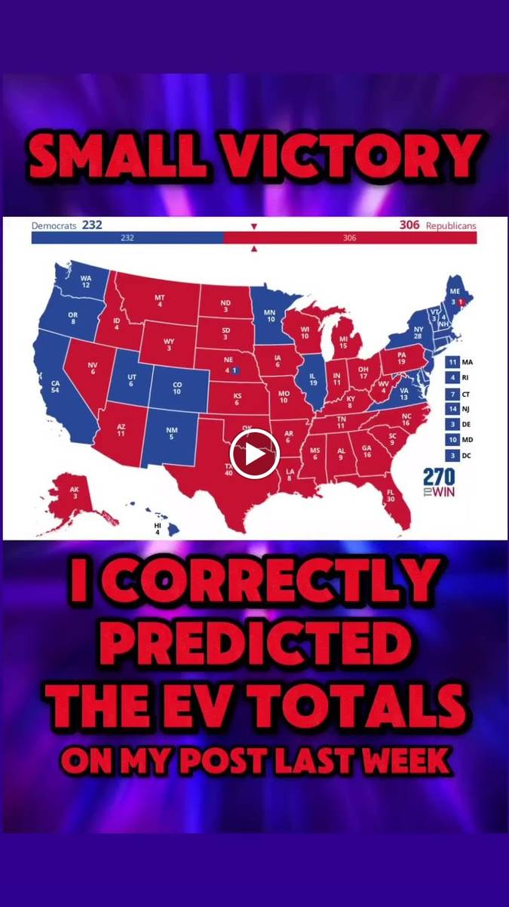

+++
id = "dat:1419-igstories-2024-ev-prediction-correct"
layer = 1
type = "datum"
title = "Dan's claimed-correct 2024 EV prediction (Dem 232 / Rep 306)"
claim = "A story shows a 2024 electoral map (Democrats 232, Republicans 306) under Dan's text: 'SMALL VICTORY / I CORRECTLY PREDICTED THE EV TOTALS ON MY POST LAST WEEK.' The screenshot proves he made the claim; whether 232/306 were the actual official totals is an external-research question, not established by the screenshot."
cites = ["src:gphotos-ig-stories"]
confidence = "high"
tags = ["politics", "forecasting", "2024-election"]
importance = 3
created = "2026-09-11"
+++

**Evidence class:** audiovisual for the claim; external for the verification.

Discipline: the datum is 'Dan publicly claimed a correct EV prediction with these numbers,' not 'the prediction was correct.' An official-results comparison belongs in L4 research with a cited external source; it is not smuggled in here.

