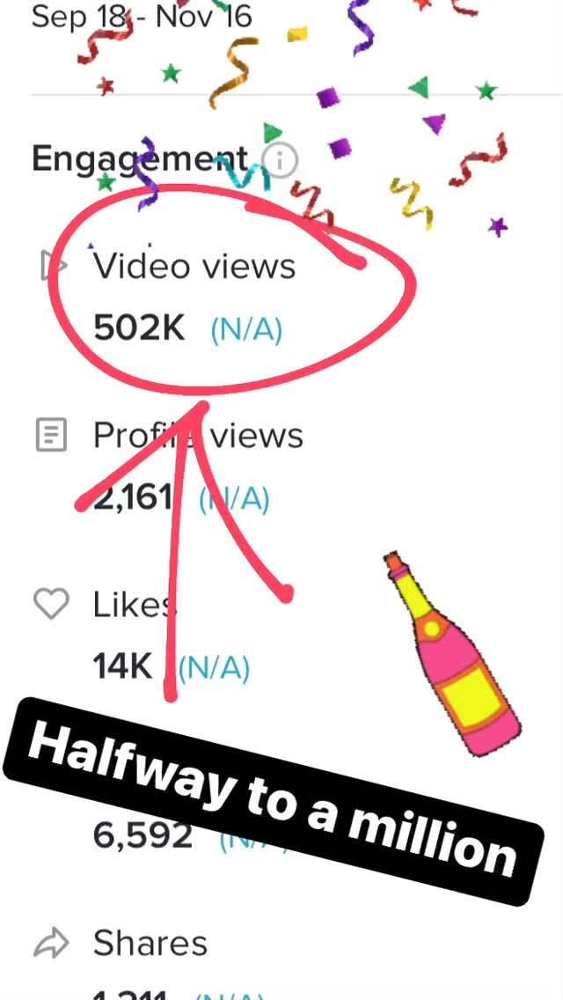

+++
id = "dat:1420-igstories-tiktok-502k-views"
layer = 1
type = "datum"
title = "TikTok analytics screenshot: 502K video views (Sep 18 - Nov 16)"
claim = "A TikTok analytics screenshot shows 502K video views (circled in pink), 2,161 profile views, 14K likes, 1,211 shares over the period 'Sep 18 - Nov 16'; Dan's overlay text reads 'Halfway to a million.' The year is not stated in the screenshot - 2023 is contextual inference from album position, not established fact."
cites = ["src:gphotos-ig-stories"]
confidence = "moderate"
tags = ["tiktok", "music-career", "metrics"]
importance = 3
created = "2026-09-11"
+++

**Evidence class:** audiovisual (screenshot).

The 502K figure is documented reach for Dan's content in that window - his largest held viewership number. The content of the viewed videos is not identified in the screenshot. Year inference flagged, not laundered.

