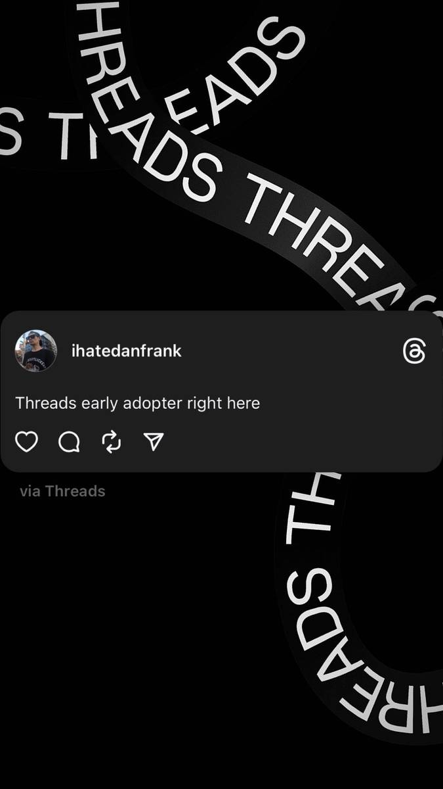

+++
id = "dat:1421-igstories-threads-early-adopter"
layer = 1
type = "datum"
title = "@ihatedanfrank Threads 'early adopter' post (July 2023 context)"
claim = "A story shows a Threads profile for @ihatedanfrank with the text 'Threads early adopter right here' over a grid of thumbnails (podcast studio, dogs, street photography). Threads launched July 5, 2023; the July-2023 dating is contextual inference unless item metadata establishes it."
cites = ["src:gphotos-ig-stories"]
confidence = "high"
tags = ["social-media", "threads"]
importance = 2
created = "2026-09-11"
+++

**Evidence class:** audiovisual (screenshot of Dan's own post).

