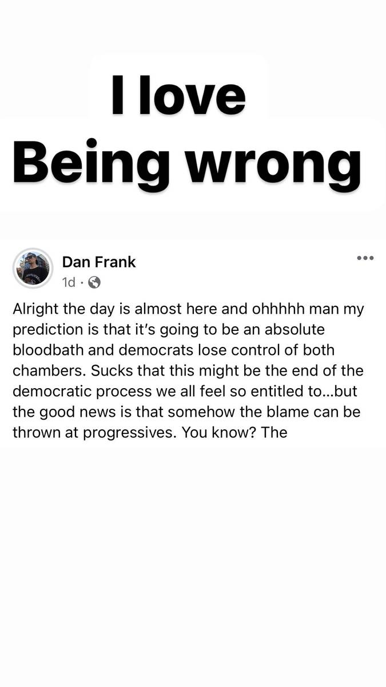

+++
id = "dat:1422-igstories-midterms-liveblog-2022"
layer = 1
type = "datum"
title = "2022 midterms night liveblog cluster (failed 'bloodbath' prediction, self-correction)"
claim = "Stories s18-s26 document 2022 midterms night in sequence: pre-election Facebook post predicting a Republican 'bloodbath' (s23); post-hoc framing 'I love Being wrong' (s23); Hobbs AZ projection 'This one feels Extra good' (s19); 538 uncalled-House table (s20); Trump's '174 wins' Truth Social post (s24); Axios GOP-endorsee tracker (s25); Palmer Report Senate math (s26)."
cites = ["src:gphotos-ig-stories"]
confidence = "high"
tags = ["politics", "forecasting", "2022-midterms"]
importance = 3
created = "2026-09-11"

[when]
start = "2022-11-08"
end = "2022-11-09"
+++

**Evidence class:** audiovisual (screenshots of Dan's own posts plus reposted media).

The cluster is a complete mini-arc: confident pre-election prediction, wrong outcome, explicit public self-correction ('I love Being wrong'). This is the documented instance behind int:midterms-i-love-being-wrong-self-correction.

