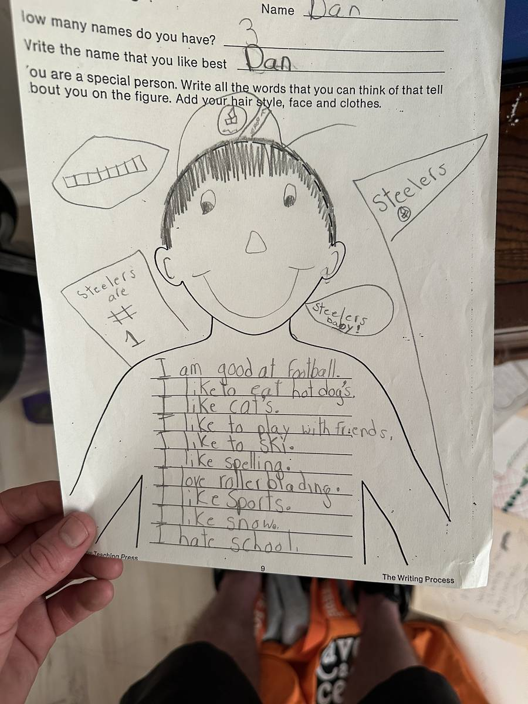

+++
id = "dat:1423-schooldocs-self-portrait-worksheet"
layer = 1
type = "datum"
title = "Childhood self-portrait worksheet ('Name Dan' / 'I hate school')"
claim = "A childhood worksheet in Dan's hand (d29): 'Name Dan'; 'How many names do you have? 3'; 'Write the name that you like best Dan'; figure text reads 'I am good at football. / I like to eat hot dog's. / I like cat's. / I like to play with friends. / I like to ski. / I like spelling. / I love roller blading. / I like Sports. / I like snow. / I hate school.'; margin drawings read 'Steelers are # 1' and 'Steelers baby!'."
cites = ["src:gphotos-school-docs"]
confidence = "high"
tags = ["childhood", "dan", "school"]
importance = 3
created = "2026-09-11"

[[edges]]
rel = "about"
target = "ent:dan"
strength = "strong"
asserted_by = "self"
+++

**Evidence class:** audiovisual (Dan's own childhood writing, primary).

The worksheet is direct primary evidence of childhood self-description: football, hot dogs, cats, friends, skiing, spelling, rollerblading, sports, snow - and the closing 'I hate school,' consistent with the documented adversarial school posture. The apostrophe errors are transcribed as written.

