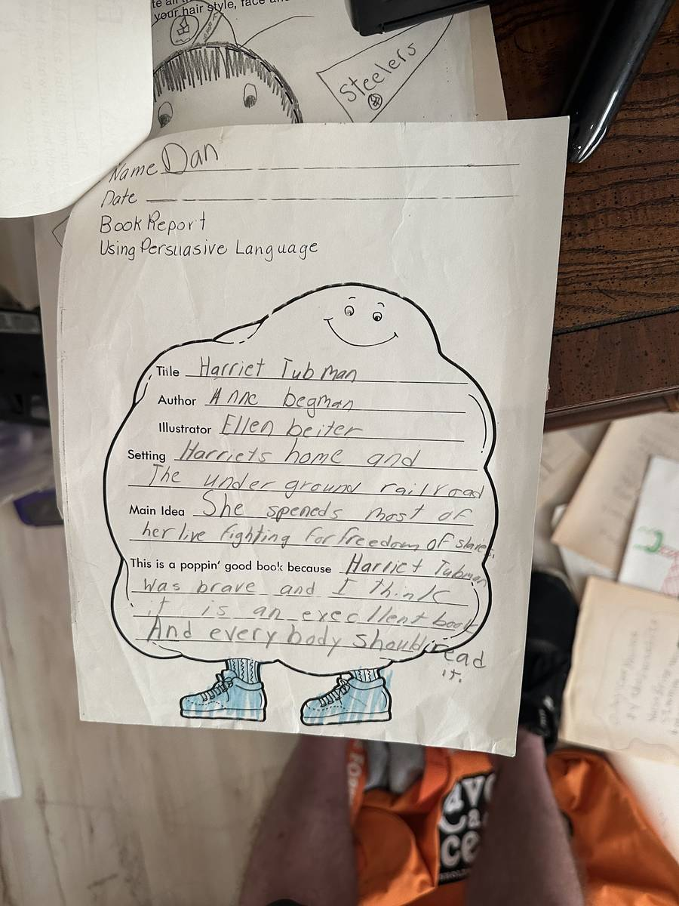

+++
id = "dat:1425-schooldocs-tubman-book-report"
layer = 1
type = "datum"
title = "Harriet Tubman book report ('This is a poppin' good book')"
claim = "A 'Book Report / Using Persuasive Language' worksheet (d28) in Dan's hand: Name Dan; Title 'Harriet Tubman'; Author 'Anne Begman' [uncertain]; Illustrator 'Ellen beiter' [uncertain]; 'Main Idea She speneds most of her live fighting for freedom of slaves'; closing: 'This is a poppin' good book because Harriet Tubman was brave and I think it is an excellent book And every body should read it.'"
cites = ["src:gphotos-school-docs"]
confidence = "high"
tags = ["childhood", "school", "dan"]
importance = 2
created = "2026-09-11"

[[edges]]
rel = "about"
target = "ent:dan"
strength = "strong"
asserted_by = "self"
+++

**Evidence class:** audiovisual (Dan's own childhood writing, primary).

Spelling transcribed as written ('speneds', 'live', 'every body'). The author/illustrator reads are uncertain and marked so.

