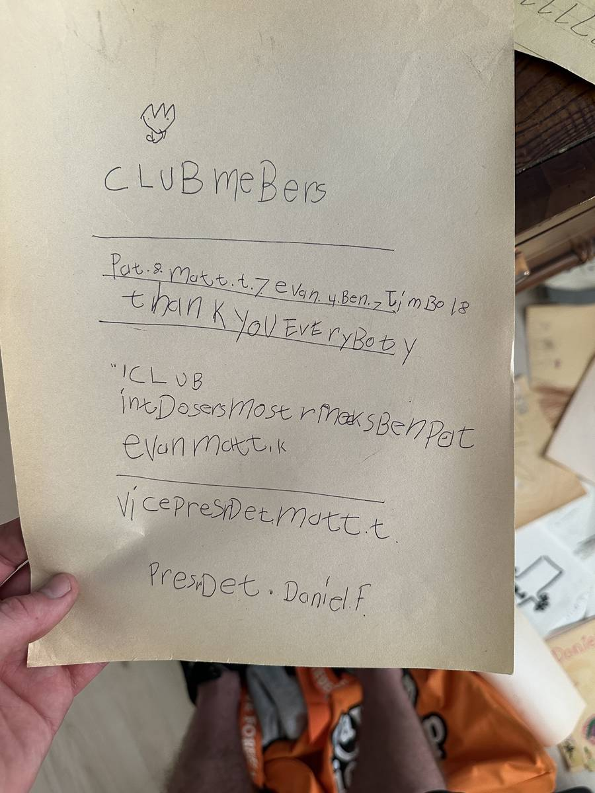

+++
id = "dat:1426-schooldocs-club-roster"
layer = 1
type = "datum"
title = "Childhood club roster ('PresDet. Daniel. F.')"
claim = "A handwritten roster (d23) headed 'CLUB meBers [members]' lists Pat, Matt. t., Evan, Ben; offices: 'Vice PresDet. matt. t.' and 'PresDet. Daniel. F.'; one further line reads 'I'm Bo 18' [uncertain]."
cites = ["src:gphotos-school-docs"]
confidence = "moderate"
tags = ["childhood", "dan"]
importance = 2
created = "2026-09-11"

[[edges]]
rel = "about"
target = "ent:dan"
strength = "moderate"
asserted_by = "llm"
+++

**Evidence class:** audiovisual (primary for the document; transcription partially uncertain).

The 'Daniel. F.' presidency is the legible load-bearing content; the 'I'm Bo 18' line is not relied on.

