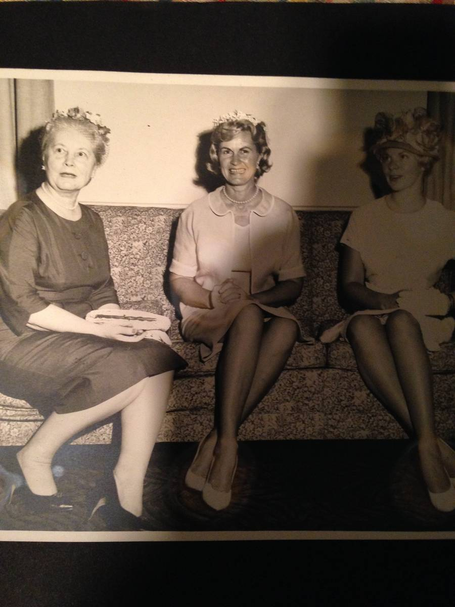

+++
id = "dat:1429-fran-library-vintage-bw-unverified"
layer = 1
type = "datum"
title = "Vintage B&W photo of three women (center figure unverified)"
claim = "A photo-of-a-photo (f23) shows three women in 1960s formal dress (hats, pearls, gloves); the center figure in a light dress with pearls plausibly resembles a young Fran Coldren, but this identification is unverified and no date, location, or other identities are established."
cites = ["src:gphotos-fran-library"]
confidence = "speculative"
tags = ["fran-coldren", "photographs"]
importance = 1
created = "2026-09-11"
+++

**Evidence class:** audiovisual; identity attribution is speculative and graded accordingly.

